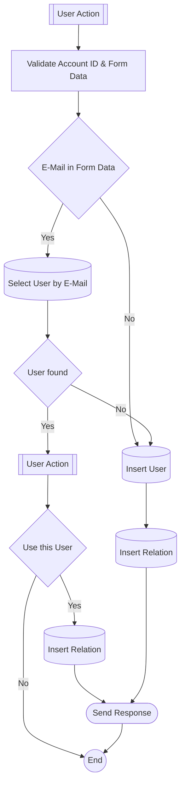

# Flows

## Insert User Flow

```mermaid
graph TB;
	id1[[User Action]] --> id2[Validate Account ID & Form Data]
	id2 --> id17
	id17{E-Mail in Form Data} -- Yes --> id5[(Select User by E-Mail)]
	id17 -- No --> id7
	id5 --> id6{User found}
	id6 -- Yes --> id8[[User Action]]
	id8 --> id10{Use this User}
	id10 -- Yes --> id11[(Insert Relation)]
	id11 --> id13([Send Response])
	id10 -- No --> id12((End))
	id6 -- No --> id7[(Insert User)]
	id7 --> id9[(Insert Relation)]
	id9 --> id13
	id13 --> id12
```