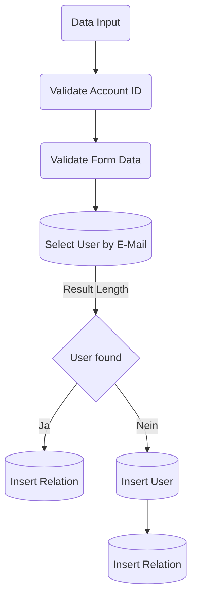

# Mermaid Test

```mermaid
graph TD;
	id1(Data Input) --> id2(Validate Account ID)
	id2 --> id3(Validate Form Data)
	id3 --> id5[(Select User by E-Mail)]
	id5 --Result Length--> id6{User found}
	id6 --Ja--> id8[(Insert Relation)]
	id6 --Nein--> id7[(Insert User)]
	id7 --> id9[(Insert Relation)]
```